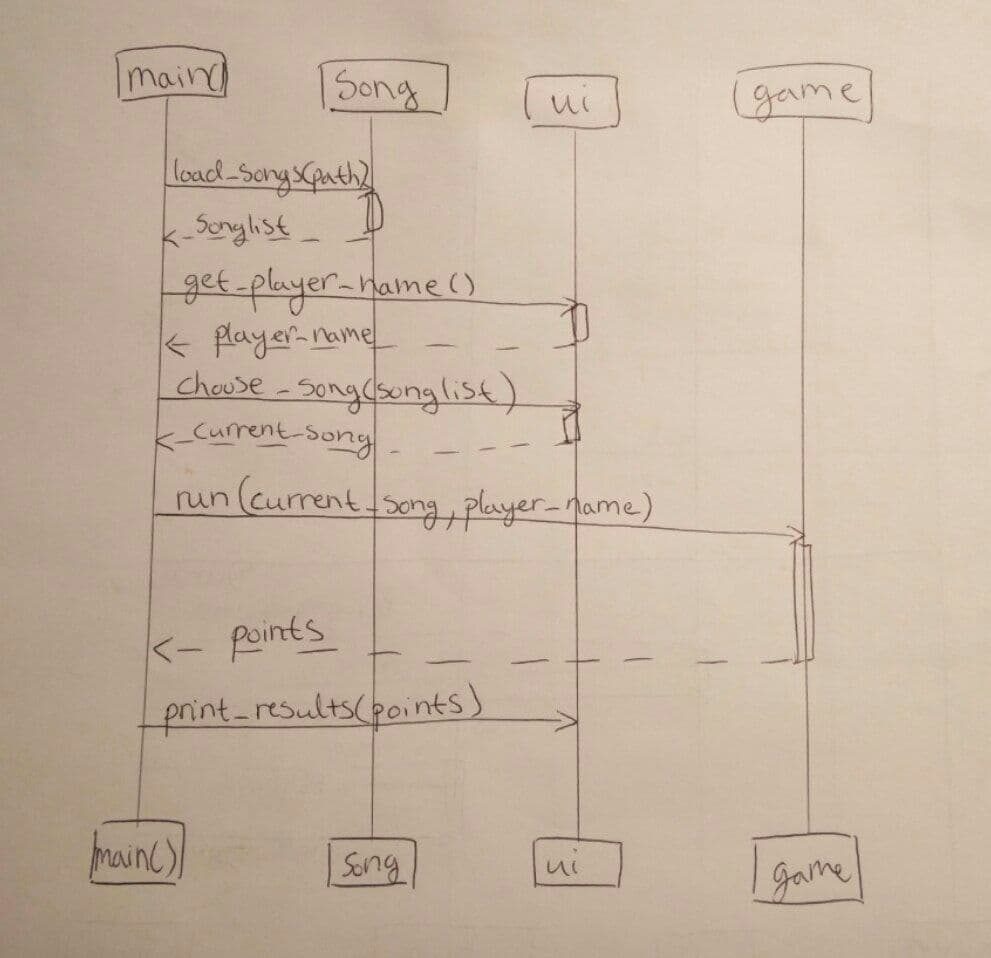
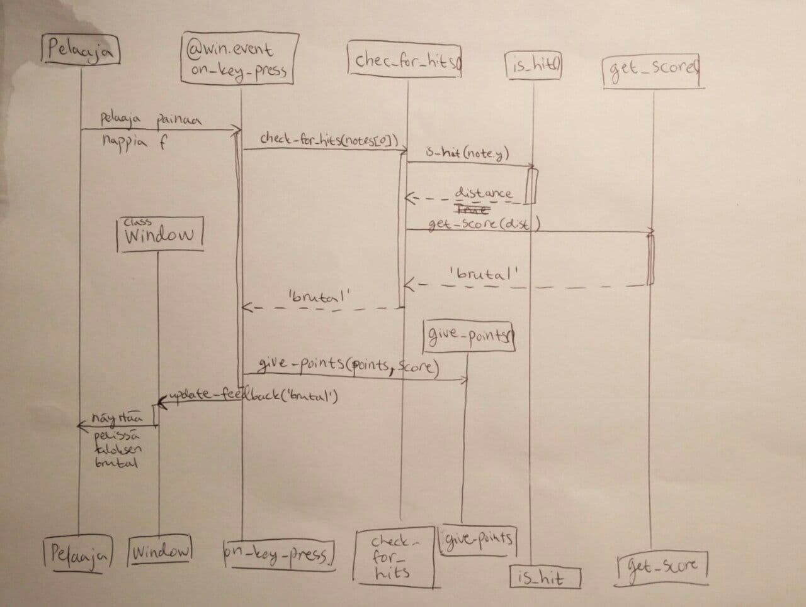

# Arkkitehtuurikuvaus

## Ohjelman toiminnallinen rakenne

Ohjelman (vanhentunut) pakkauskaavio.

### Sekvenssikaaviot
#### Ohjelman perustoiminnallisuus

#### Mitä tapahtuu, kun pelaaja painaa nappia f

