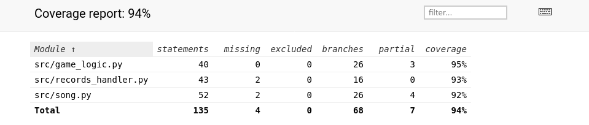

# Ohjelman testausta koskeva dokumentaatio

Ohjelmaa on testattu sekä yksittäisiä funktioita arvoilla, että tiedostojen lukemista ja kirjoittamista. Lisäksi pelin toimintaa on testattu manuaalisesti.

- Pelin loogisten toimintojen testaus tapahtuu luokalla TestGameLogic.
- Tulosten kirjoittaisen ja lukemisen toiminta testataan luokalla TestRecordsHandler.
- Luokan Song toiminallisuus sekä kappaleiden lataaminen testataan luokalla TestSong.

Biisien toimintojen testaukseen on olemassa oma hakemisto test-hakemistossa. RecordsHandler tekee testinsä oikeaan ennätyshakemiston, mutta ei jätä sinne mitään testien jäljiltä.

Muiden moduulien toiminta on testattu kokeilemalla ohjelmaa manuaalisesti erilaisin syöttein.

## Testikattavuus

Käyttöliittymiä ja sekä ohjelman, että pelitilan main-silmukoita lukuunottamatta testikattavuus on on 94%

Testeistä on jäänyt erään virheilmoituksen testi ja tuloskansion luonti jos tällaista ei ole.

## Järjestelmätestit

Sovellusta on testattu manuaalisesti suorittamalla.
Ohjelma on asennettu käyttöohjeiden mukaisesti ja käytetty sen mukaisesti Linux-käyttöjärjestelmässä.
