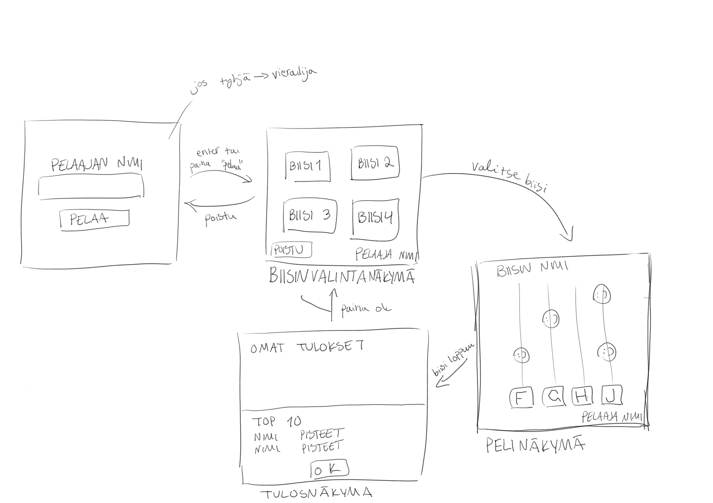

# Vaatimusmäärittely

## Sovelluksen tarkoitus

Sovellus on rytmipeli. Siinä pitää painella oikeita nappeja oikean rytmin tahtiin. Sovellus on ns. arcadetyylinen rytmipeli, eli käyttäjien ainoa indentifikaattori on väliaikaseisti valittu pelaajanimi, jolla tulokset tallentuvat top 10 -listaan.

## Käyttäjät

Sovelluksessa on yksi käyttäjätyyppi eli *pelaaja*.

## Käyttöliittymäluonnos

Sovelluksessa on neljä tilaa: kirjautuminen, kappaleen valinta, pelitila ja tulosten esittäminen.

**Huom** itse rytmipelin konkreettiseen ulkonäköön voi tulla muutoksia

## Persuversion ominaisuudet
- valita pelaajanimi (tekstipohjainen)
- valita biisi (tekstipohjainen)
- pelata peliä
- nähdä omat tulokset ja pisteet (tekstipohjainen)
- nähdä muiden 10 parasta pistemäärää

### Avatessa peli
Pelin avautuessa tulee antaa pelille pelaajanimensä. Kentän voi jättää myös tyhjäksi, jolloin nimeksi tulee automaattisesti vierailija. Klassiseen arcadetyyliin nikki voi olla mitä vain, sen ei tarvitse olla uniikki.

### Pelissä navigointi
Valittuaan nimensä pelaaja saa valita biisin. Pelissä on valmiiksi biisejä kaksi, mutta biisejä on helppo tehdä lisää ja sille löytyy erillinen ohje käyttöohjeista. Biisin valittuaan biisi alkaa soida ja päsee pelaamaan rytmipeliä. Biisin loputtua näkee omat tuloksensa ja pisteet, sekä muiden pelaajien top 10 pisteet. Tästä pääsee takaisin biisinvalintanäkymään.

### Rytmipelin toiminta
Rytmipelissä tulee musiikin tahdissa neljää riviä pitkin nuotteja. Nuotin osuessa tiettyyn kohtaan tulee iskeä riviä vastaavaa nappia. Napit ovat f, g, h, ja j. 

### Pelin kontrollit
Pelin kontrollit ovat f, g, h, ja j. Muualla pelissä on tekstikäyttöliittymä.

## Jatkokehitysideoita
- Tekstikäyttöliittymän siirtäminen graafiseksi
- uusien biisien luonti
- eri vaikeustasojen lisääminen biiseihin
- visuaalisen ulkoasun parantaminen
- nuottien nopeusasetusten muuttaminen
