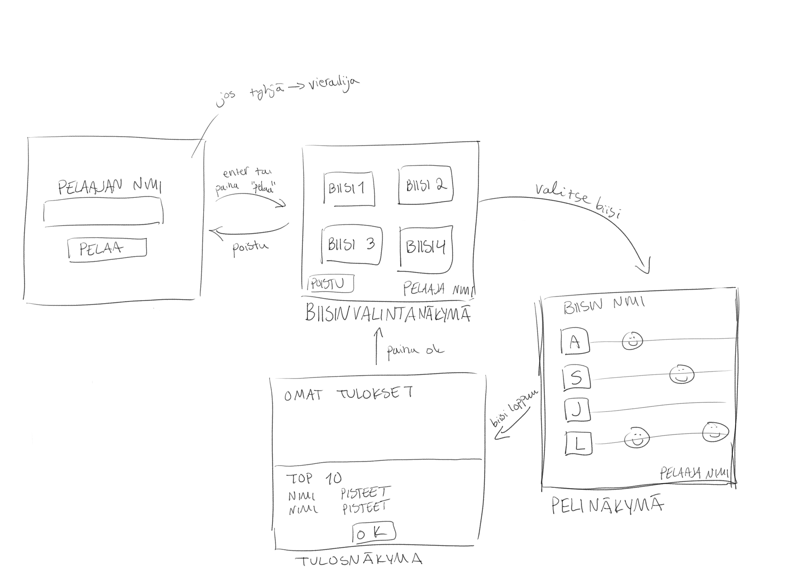

# Vaatimusmäärittely

## Sovelluksen tarkoitus

Sovellus on rytmipeli. Siinä pitää klikkailla annettuja nappeja oikean rytmin tahtiin.

## Käyttäjät

Sovelluksessa on yksi käyttäjätyyppi eli *pelaaja*.

## Käyttöliittymäluonnos

Sovelluksessa on neljä näkymää: kirjautumisnäkymä, kappaleen valintanäkymä, pelinäkymä ja tulosnäkymä.

## Persuversion ominaisuudet
- antaa käyttäjätunnus
- valita biisi
- pelata peliä
- nähdä omat tulokset ja pisteet
- nähdä muiden 10 parasta pistemäärää

### Avatessa peli
Pelin avautuessa tulee antaa pelille pelaajanimensä ja painaa ok. Kentän voi jättää myös tyhjäksi, jolloin nimeksi tulee automaattisesti vierailija. Klassiseen arcadetyyliin nikki voi olla mitä vain, sen ei tarvitse olla uniikki ja se voi olla max 10 merkkiä pitkä.

### Pelissä navigointi
Valittuaan nimensä pelaaja saa valita biisin. Tässä projektissa teen luultavasti vain yhden pelattavan kappaleen, mutta tarkoitus on tehdä pelikappaleiden formaatista sellainen, että biisejä olisi helppo tehdä lisää. Biisin valittuaan biisi alkaa soida ja päsee pelaamaan rytmipeliä. Biisin loputtua näkee omat tuloksensa ja pisteet, sekä muiden pelaajien top 10 pisteet. Tästä pääsee takaisin biisinvalintanäkymään.

### Rytmipelin toiminta
Rytmipelissä tulee musiikin tahdissa neljää viivaa pitkin nuotteja. Nuotin osuessa tiettyyn kohtaan tulee iskeä viivaa vastaavaa nappia. Napit ovat f, g, h, ja j. 

### Pelin kontrollit
Pelin kontrollit ovat f, g, h, ja j. Muualla kuin itse pelitilassa f ja j ovat valikoissa liikkumista vasrten, g on peruutus ja h ajaa enterin virkaa.

## Jatkokehitysideoita
- uusien biisien luonti
- eri vaikeustasojen lisääminen biiseihin
- visuaalisen ulkoasun parantaminen
- nuottien nopeusasetusten muuttaminen
